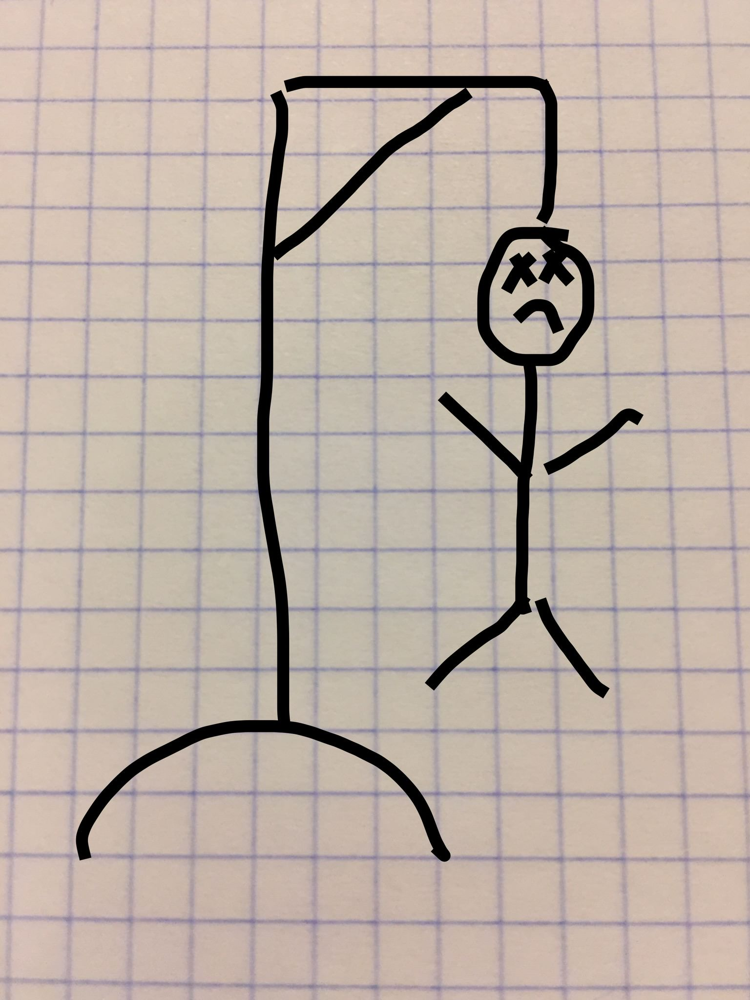

# The Hangman Game

A Sinatra application 

## How to run it
* git clone `git@github.com:Gabbendorf/hangman.git`
* navigate into main folder `hangman`
* type `bundle install`
* type `ruby app.rb`
* open your favourite web browser at `http://localhost:4567`
* HAVE FUN!
